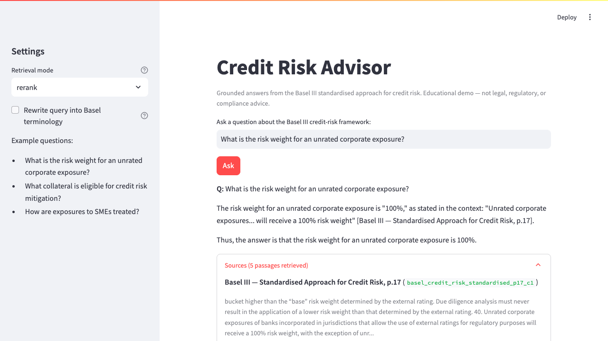
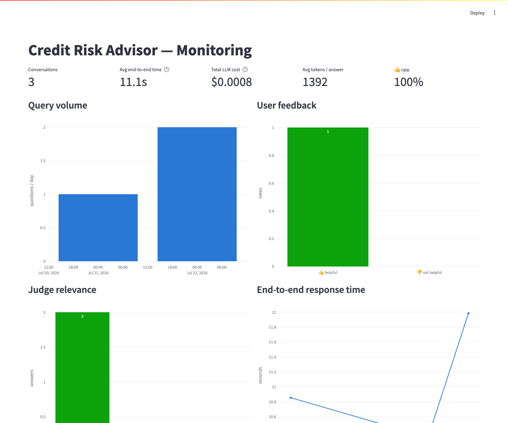
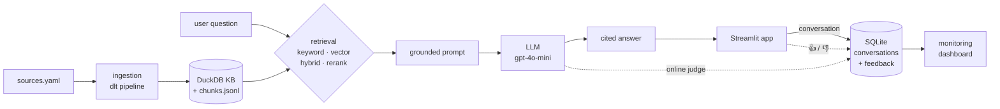
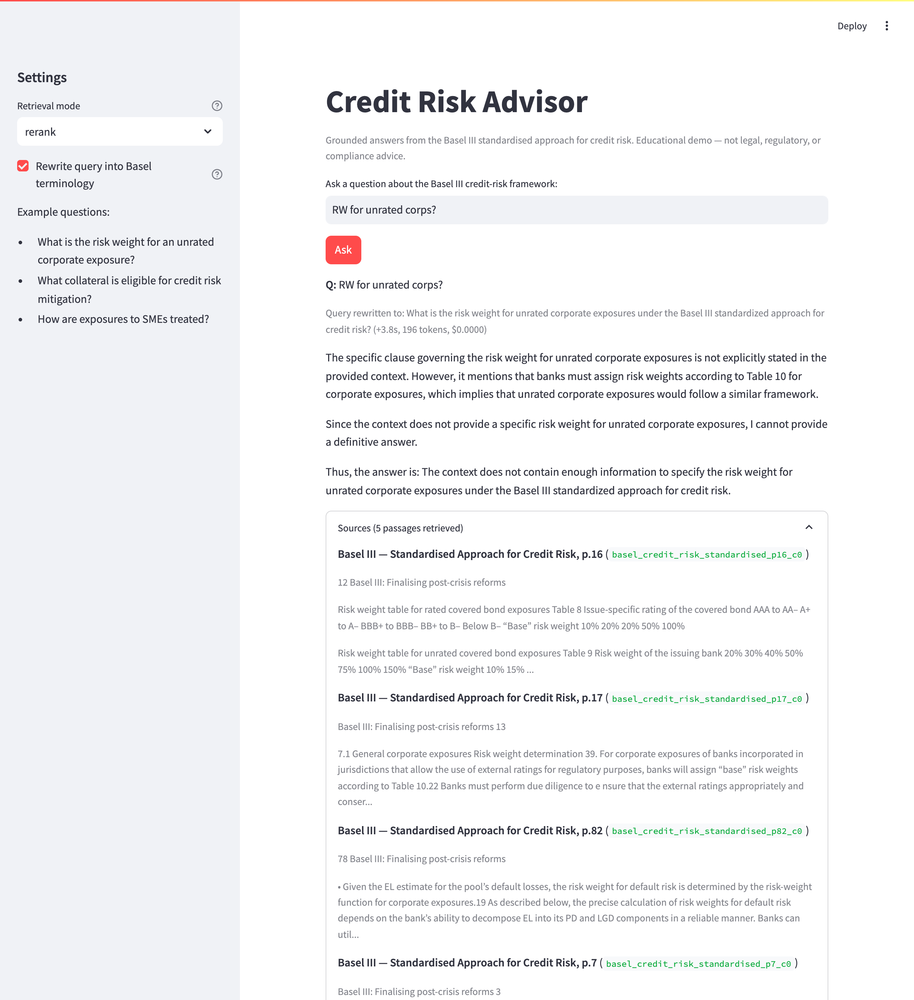

# Credit Risk Advisor

[](https://github.com/KuenaMahase/credit-risk-advisor/actions/workflows/ci.yml)

A conversational assistant that helps credit-risk analysts get grounded
answers from banking regulation. It retrieves relevant passages from the
Basel III credit-risk framework and answers using only that context, with
source and page citations for every claim.

> **Status:** LLM Zoomcamp 2026 capstone — live, tested, and ready for peer
> review.

---

## Demo

**Live app:** [Launch Credit Risk Advisor](https://credit-risk-advisor-kuena.streamlit.app/)

A grounded answer with per-claim citations and the retrieved source passages:



The monitoring dashboard — feedback split, online-judge relevance, latency, and
all-in LLM cost across every logged conversation:



---

## Problem

Analysts in credit-risk functions constantly need to answer questions like
*"how is a corporate exposure risk-weighted under the standardised approach?"*
or *"what collateral is eligible for credit risk mitigation?"*

- The source material is a dense, 200+ page regulatory framework.
- Finding the relevant clause means scrolling through long PDFs.
- General-purpose chatbots answer from memory and hallucinate specifics —
  unacceptable when the answer needs to trace back to an actual standard.

This assistant retrieves the relevant regulatory text first, then answers using
only that context, so every answer is grounded in a real source passage — and
refuses to answer when the knowledge base doesn't contain the information.

## Data sources

This project uses one public regulatory publication. The ingestion pipeline
downloads it at runtime from the official publisher; the PDF and derived
chunks, embeddings, and database are excluded from Git.

| Document | Publisher | Published | Official source |
| --- | --- | --- | --- |
| *Basel III: Finalising post-crisis reforms* (d424) | Basel Committee on Banking Supervision, hosted by the Bank for International Settlements (BIS) | 7 December 2017 | [Publication page](https://www.bis.org/bcbs/publ/d424.htm) · [PDF](https://www.bis.org/bcbs/publ/d424.pdf) |

The publication is copyright Bank for International Settlements. This is a
non-commercial educational project. The [BIS terms of
use](https://www.bis.org/terms_conditions.htm) permit non-commercial use of BIS
material and limited extracts with source attribution. The app links to the
official publication and limits each displayed retrieved passage to 50 words
(at most 250 words across the five displayed passages). It does not use BIS or
BCBS logos and does not claim affiliation, approval, or endorsement.

Exact machine-readable provenance is in
[`ingestion/sources.yaml`](ingestion/sources.yaml); the complete attribution and
reuse notice is in [`THIRD_PARTY_NOTICES.md`](THIRD_PARTY_NOTICES.md). Anyone
adapting this project for commercial use or broader reproduction should review
the current BIS terms and request permission where required. The consolidated
[Basel Framework](https://www.bis.org/basel_framework/) is the current
authoritative standard; this corpus is the December 2017 publication snapshot.

## Disclaimer

This is an **educational demonstration** built for the LLM Zoomcamp course.
Answers are generated by an AI model and may be incomplete or incorrect. This
tool does **not** provide legal, regulatory, or compliance advice. Always verify
against the official source documents and consult a qualified professional for
real compliance decisions. Credit Risk Advisor is independent and is not
affiliated with, approved by, or endorsed by the BIS or the Basel Committee on
Banking Supervision.

### Data handling

For each question, the app sends the question and selected public BIS excerpts
to the OpenAI API for query rewriting (when enabled), answer generation, and
online relevance judging. API requests set `store=False`. OpenAI states that API
inputs and outputs are not used for model training by default unless the
customer opts in; standard abuse-monitoring logs may nevertheless retain
customer content for up to 30 days. See OpenAI's official [API data
controls](https://platform.openai.com/docs/models/default-usage-policies-by-endpoint)
for the current policy and available retention controls.

The app also records questions, answers, metrics, and feedback in its SQLite
monitoring database. Local Docker data persists in its volume; hosted demo data
may be reset with the Streamlit filesystem. **Do not submit personal data,
customer data, account information, proprietary bank data, or any other
confidential information.**

---

## Architecture



The retrieval layer offers four modes; evaluation picks the winner (`rerank`)
as the default. The Streamlit app logs every conversation and both feedback
signals to SQLite, and the monitoring dashboard reads that shared store.

## Quickstart

Prerequisites: Docker Desktop for the recommended path, or Python 3.12 for the
local path, plus an OpenAI API key.

### Docker (recommended)

```bash
git clone https://github.com/KuenaMahase/credit-risk-advisor.git
cd credit-risk-advisor
cp .env.example .env      # add your OpenAI API key
docker compose up --build
# app:       http://localhost:8501
# dashboard: http://localhost:8502
```

Everything runs in compose: the assistant and the monitoring dashboard share
one image and one SQLite volume. The image build downloads the source PDF,
builds the knowledge base with the dlt pipeline, and bakes the embedding +
reranking models in — so `up` needs no other host-side steps. The first build
downloads the CPU-only ML stack and model weights; allow roughly 6–30 minutes
depending on network speed. Rebuilds reuse Docker's cache. Both services expose
health checks (`docker compose ps` shows `healthy`).

### Local (venv)

```bash
python3.12 -m venv .venv && source .venv/bin/activate
pip install -r requirements.txt
cp .env.example .env              # add your OpenAI API key
python ingestion/dlt_pipeline.py  # dlt pipeline: downloads sources, loads the
                                  # DuckDB knowledge base + chunks.jsonl
# (or `python ingestion/ingest.py` for the minimal script version)

python -m rag.search "risk weight for unrated corporates"   # retrieval only
python -m rag.llm "What is the risk weight for a corporate exposure with no external credit rating?"

streamlit run app/app.py               # the assistant UI (with feedback buttons)
streamlit run monitoring/dashboard.py  # monitoring dashboard (6 charts + table)
```

## Testing

The regression suite uses only local fixtures and mocks — it never makes a paid
OpenAI call or downloads a model:

```bash
python -m unittest discover -s tests -v
npx --yes pyright@1.1.411 --pythonpath .venv/bin/python
```

The nine tests cover cloud cold-start behavior, the Streamlit entrypoint,
database creation and metric breakdowns, model-aware cost calculation, citation
context formatting, and reciprocal rank fusion. For every push and pull request,
GitHub Actions installs the project on Python 3.12, compiles every source file,
runs the pinned Pyright check, and executes the same nine tests via
[`.github/workflows/ci.yml`](.github/workflows/ci.yml).

## Evaluation

### Retrieval

Ground truth: 450 questions generated by an LLM from 150 sampled knowledge-base
chunks (`python -m eval.ground_truth`, seeded), where each question's known-correct
target is the chunk it was generated from. A retrieved chunk counts as relevant
only on an exact `chunk_id` match. Metrics over top-5 results
(`python -m eval.evaluate_retrieval`):

| Mode    | Hit rate  | MRR       | Avg latency |
|---------|-----------|-----------|-------------|
| keyword | 0.776     | 0.592     | 1 ms        |
| vector  | 0.658     | 0.483     | 32 ms       |
| hybrid  | 0.816     | 0.595     | 23 ms       |
| rerank  | **0.911** | **0.768** | 184 ms      |

Findings:

- Keyword search beats pure vector search on this corpus — regulatory text is
  terminology-heavy, so exact-term matching carries a lot of signal.
- Hybrid (reciprocal rank fusion of keyword + vector) beats both of its inputs
  on hit rate. Tuning (`--tune`) found RRF `k=10` outperforms the classic
  `k=60` (hit rate 0.822 vs 0.796 standalone); pool size mattered little.
- Cross-encoder reranking over the hybrid candidates wins decisively on both
  metrics, at a latency still fine for interactive use — **so `rerank` is the
  mode the assistant uses** (`DEFAULT_SEARCH_MODE` in `rag/llm.py`).

### LLM answers

Two prompt variants were compared with an LLM-as-a-judge (`python -m eval.evaluate_llm`)
on 200 seeded ground-truth questions, both using the winning `rerank` retrieval.
The judge marks each answer good/bad against the source excerpt the question
was generated from; refusals count as bad when the excerpt does contain the
answer, so retrieval misses are folded into end-to-end quality.

| Prompt variant                                           | Good rate | n   |
|----------------------------------------------------------|-----------|-----|
| v1_cited (answer with citations)                         | 0.805     | 200 |
| v2_quote_first (quote the governing clause, then answer) | **0.820** | 200 |

`v2_quote_first` is used in production (`INSTRUCTIONS` in `rag/llm.py`).
Caveats worth knowing: the margin is small (3 answers out of 200), and the
judge is the same model family as the generator (gpt-4o-mini judging
gpt-4o-mini) — a standard setup for course projects, but a known bias.

### Query rewriting

An LLM step that rewrites the user's query into framework terminology
(`rewrite_query` in `rag/llm.py` — e.g. *"CCF for trade LCs?"* → *"What is the
credit conversion factor for trade letters of credit…"*) was evaluated on the
same 450 ground-truth questions (`python -m eval.evaluate_rewrite`):

| Queries   | Hit rate  | MRR       | Overhead per query   |
|-----------|-----------|-----------|----------------------|
| original  | **0.911** | **0.768** | —                    |
| rewritten | 0.756     | 0.581     | +1.4 s, ~211 tokens  |

Rewriting **hurts** on this ground truth, so it is **off by default** and
exposed as an evaluated optional toggle in the app. Why: the ground-truth
questions are LLM-generated from the framework text, so they already use the
framework's own vocabulary — rewriting paraphrases them away from the wording
retrieval matches on. The toggle exists for the case rewriting was built for:
terse practitioner shorthand (like the CCF example above), which the ground
truth does not contain.

The per-question rewrites are committed to `eval/rewrite_queries.csv`, so this
comparison reproduces from cache with no API calls (`python -m eval.evaluate_rewrite`;
pass `--refresh` to regenerate them from the model). When the toggle is used in
the app, the rewritten query and its tokens/latency/cost are logged to the
monitoring store and shown in the dashboard's recent-conversations table.

The toggle in action — shorthand *"RW for unrated corps?"* is expanded into
framework wording (with the rewrite's own cost shown), and here the reranked
passages don't pin the exact figure, so the assistant refuses rather than
guessing — the same effect the numbers above measure:



## Monitoring

Every question answered in the app is logged to a SQLite store
(`monitoring/advisor.db`, gitignored) with the retrieval mode, token usage,
all model costs, and end-to-end response time. The timing covers the optional
rewrite, retrieval and answer generation, logging, and the synchronous judge;
answer and judge timings are also retained separately. Each answer gets two
quality signals:

- **User feedback** — 👍/👎 buttons in the app (`feedback` table, source `user`).
- **Online LLM judge** — every live answer is auto-classified as
  RELEVANT / PARTLY_RELEVANT / NON_RELEVANT with an explanation
  (`monitoring/judge.py`, source `judge`) — no ground truth needed.

`streamlit run monitoring/dashboard.py` shows headline metrics (conversations,
average end-to-end time, all-in cost, average answer tokens, 👍 rate) and six
charts: query volume, user feedback split, judge relevance distribution,
end-to-end response time, cumulative LLM cost, and retrieval-mode usage, plus a
recent-conversations table. All-in cost includes answer generation, optional
query rewriting, and the online judge.

## Configuration

`.env.example` documents the supported settings:

- `OPENAI_API_KEY` is required for answer generation and judging.
- `LLM_MODEL` defaults to `gpt-4o-mini`.
- Custom models must also provide `LLM_PRICE_PER_M_INPUT` and
  `LLM_PRICE_PER_M_OUTPUT` in USD per one million tokens. This prevents the
  dashboard from silently applying the wrong model price.

The default price map follows the official
[gpt-4o-mini model pricing](https://developers.openai.com/api/docs/models/gpt-4o-mini).

Secrets are excluded from both Git and the Docker build context.

## Limitations

- The knowledge base covers the Basel III standardised approach for credit
  risk; it is not a complete picture of any jurisdiction's prudential regime.
  The corpus can be extended by adding entries to `ingestion/sources.yaml`.
- Answers are only as current as the ingested document versions.
- Chunking is a fixed-size sliding window; a clause split across chunk
  boundaries relies on the 150-character overlap for retrieval.
- The live relevance judge measures whether an answer addresses the question;
  without ground truth, it cannot independently prove factual correctness.
- SQLite is durable in the Docker volume, but a Streamlit Community Cloud
  filesystem can be replaced when the app restarts, so hosted monitoring rows
  are demonstration data rather than durable records.

## Self-evaluation against the rubric

Self-assessment against the [LLM Zoomcamp project
rubric](https://github.com/DataTalksClub/llm-zoomcamp/blob/main/project.md),
with the evidence for each point.

| Criterion | Self-assessed | Evidence |
| --- | --- | --- |
| Problem description | 2 / 2 | [Problem](#problem) — who needs it and why grounding matters |
| Retrieval flow | 2 / 2 | knowledge base **and** LLM in the flow: [`rag/search.py`](rag/search.py), [`rag/llm.py`](rag/llm.py) |
| Retrieval evaluation | 2 / 2 | four modes compared, best (`rerank`) wired as default: [Retrieval](#retrieval), [`eval/evaluate_retrieval.py`](eval/evaluate_retrieval.py) |
| LLM evaluation | 2 / 2 | two prompts judged, best (`quote_first`) wired as production: [LLM answers](#llm-answers), [`eval/evaluate_llm.py`](eval/evaluate_llm.py) |
| Interface | 2 / 2 | Streamlit UI: [`app/app.py`](app/app.py) |
| Ingestion pipeline | 2 / 2 | automated with **dlt** (a "special tool" per the rubric): [`ingestion/dlt_pipeline.py`](ingestion/dlt_pipeline.py) |
| Monitoring | 2 / 2 | user feedback **and** an online judge feeding a 6-chart dashboard: [Monitoring](#monitoring), [`monitoring/`](monitoring/) |
| Containerization | 2 / 2 | everything in docker-compose (app + dashboard, shared volume): [`Dockerfile`](Dockerfile), [`docker-compose.yml`](docker-compose.yml) |
| Reproducibility | 2 / 2 | clear instructions, dataset fetched at build time, verified by a clean `git clone` → `docker compose up` — see [Reproducibility check](#reproducibility-check) |
| Best practices | 3 / 3 | hybrid search + cross-encoder reranking + query rewriting, **each evaluated**: [Retrieval](#retrieval), [Query rewriting](#query-rewriting) |
| Cloud deployment | 2 / 2 | [public Streamlit app](https://credit-risk-advisor-kuena.streamlit.app/), cold bootstrap and real cited answer verified |

**Core: 18 / 18. Best practices: 3 / 3. Cloud bonus: 2 / 2.**

Exceptional-contribution bonus is not self-claimed.

### Reproducibility check

Verified on 2026-07-22 from an artifact-free copy and with a complete Docker
rebuild after the latest dependency changes, following the documented Docker
path:

```bash
git clone https://github.com/KuenaMahase/credit-risk-advisor.git
cd credit-risk-advisor
cp .env.example .env      # add OPENAI_API_KEY
docker compose up --build
```

Result:

- The clone contains no `chunks.jsonl`, `kb.duckdb`, or `advisor.db` — all
  gitignored. The image build produced the knowledge base itself (707 chunks)
  from `ingestion/sources.yaml`, so nothing local is assumed.
- Both services reported `healthy` (`docker compose ps`); app on `:8501`,
  dashboard on `:8502`.
- A question answered inside the freshly built container returned a correct,
  cited answer (100% risk weight for unrated corporate exposures, p.17).
- The nine-test suite passed inside the Python 3.12 image.

## Deployment

**Live assistant:**
[credit-risk-advisor-kuena.streamlit.app](https://credit-risk-advisor-kuena.streamlit.app/)

The app is deployed from `main` on Streamlit Community Cloud with Python 3.12
and [`streamlit_app.py`](streamlit_app.py) as the entrypoint. The deployment was
verified on 2026-07-22 from a clean cloud filesystem:

- [`app/bootstrap.py`](app/bootstrap.py) downloaded the official BIS PDF and
  produced 707 chunks without any committed data artifacts.
- A real `rerank` query returned the correct 100% risk weight for an unrated
  corporate exposure, quoted the governing clause, cited page 17, and received
  a `RELEVANT` verdict from the online judge.
- The warmed hosted request completed in 6.5 seconds. The first request after a
  new cloud filesystem is slower because it builds embeddings and downloads the
  embedding and cross-encoder models.

Streamlit Community Cloud hosts the assistant only. The documented Docker
Compose path remains the way to run the assistant and persistent monitoring
dashboard together; hosted SQLite rows may be reset when Streamlit replaces the
app filesystem.
