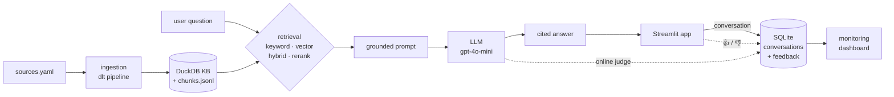

# Credit Risk Advisor

A conversational assistant that helps credit-risk analysts get grounded
answers from banking regulation. It retrieves relevant passages from the
Basel III credit-risk framework and answers using only that context, with
source and page citations for every claim.

> **Status:** work in progress (LLM Zoomcamp 2026 capstone).

---

## Problem

Analysts in credit-risk functions constantly need to answer questions like
*"how is a corporate exposure risk-weighted under the standardised approach?"*
or *"what collateral is eligible for credit risk mitigation?"*

- The source material is a dense, 200+ page regulatory framework.
- Finding the relevant clause means scrolling through long PDFs.
- General-purpose chatbots answer from memory and hallucinate specifics —
  unacceptable when the answer needs to trace back to an actual standard.

This assistant retrieves the relevant regulatory text first, then answers using
only that context, so every answer is grounded in a real source passage — and
refuses to answer when the knowledge base doesn't contain the information.

## Data sources

This project uses **public regulatory publications**. The documents are
downloaded at runtime by the ingestion pipeline directly from the official
issuing bodies — they are **not redistributed** in this repository.

| Document                                                 | Issuing body                                 | Category    |
|----------------------------------------------------------|----------------------------------------------|-------------|
| Basel III — Standardised Approach for Credit Risk (d424) | Basel Committee on Banking Supervision (BIS) | Credit risk |

Source URLs are defined in [`ingestion/sources.yaml`](ingestion/sources.yaml).
These documents are copyright of their respective organisations and are used
here for educational and research purposes. Please refer to the official
publications for the authoritative text.

## Disclaimer

This is an **educational demonstration** built for the LLM Zoomcamp course.
Answers are generated by an AI model and may be incomplete or incorrect. This
tool does **not** provide legal, regulatory, or compliance advice. Always verify
against the official source documents and consult a qualified professional for
real compliance decisions.

---

## Architecture



The retrieval layer offers four modes; evaluation picks the winner (`rerank`)
as the default. The Streamlit app logs every conversation and both feedback
signals to SQLite, and the monitoring dashboard reads that shared store.

## Quickstart

### Docker (recommended)

```bash
git clone https://github.com/KuenaMahase/credit-risk-advisor.git
cd credit-risk-advisor
cp .env.example .env      # add your OpenAI API key
docker compose up --build
# app:       http://localhost:8501
# dashboard: http://localhost:8502
```

Everything runs in compose: the assistant and the monitoring dashboard share
one image and one SQLite volume. The image build downloads the source PDF,
builds the knowledge base with the dlt pipeline, and bakes the embedding +
reranking models in — so `up` needs no other host-side steps. Expect the first
build to take about 6 minutes (CPU-only PyTorch is preinstalled to avoid the
multi-GB CUDA wheels); rebuilds are cached. Both services expose health checks
(`docker compose ps` shows `healthy`).

### Local (venv)

```bash
python -m venv .venv && source .venv/bin/activate
pip install -r requirements.txt
cp .env.example .env              # add your OpenAI API key
python ingestion/dlt_pipeline.py  # dlt pipeline: downloads sources, loads the
                                  # DuckDB knowledge base + chunks.jsonl
# (or `python ingestion/ingest.py` for the minimal script version)

python -m rag.search "risk weight for unrated corporates"   # retrieval only
python -m rag.llm "What is the risk weight for a corporate exposure with no external credit rating?"

streamlit run app/app.py               # the assistant UI (with feedback buttons)
streamlit run monitoring/dashboard.py  # monitoring dashboard (6 charts + table)
```

## Evaluation

### Retrieval

Ground truth: 450 questions generated by an LLM from 150 sampled knowledge-base
chunks (`python -m eval.ground_truth`, seeded), where each question's known-correct
target is the chunk it was generated from. A retrieved chunk counts as relevant
only on an exact `chunk_id` match. Metrics over top-5 results
(`python -m eval.evaluate_retrieval`):

| Mode    | Hit rate  | MRR       | Avg latency |
|---------|-----------|-----------|-------------|
| keyword | 0.776     | 0.592     | 1 ms        |
| vector  | 0.658     | 0.483     | 32 ms       |
| hybrid  | 0.816     | 0.595     | 23 ms       |
| rerank  | **0.911** | **0.768** | 184 ms      |

Findings:

- Keyword search beats pure vector search on this corpus — regulatory text is
  terminology-heavy, so exact-term matching carries a lot of signal.
- Hybrid (reciprocal rank fusion of keyword + vector) beats both of its inputs
  on hit rate. Tuning (`--tune`) found RRF `k=10` outperforms the classic
  `k=60` (hit rate 0.822 vs 0.796 standalone); pool size mattered little.
- Cross-encoder reranking over the hybrid candidates wins decisively on both
  metrics, at a latency still fine for interactive use — **so `rerank` is the
  mode the assistant uses** (`DEFAULT_SEARCH_MODE` in `rag/llm.py`).

### LLM answers

Two prompt variants were compared with an LLM-as-a-judge (`python -m eval.evaluate_llm`)
on 200 seeded ground-truth questions, both using the winning `rerank` retrieval.
The judge marks each answer good/bad against the source excerpt the question
was generated from; refusals count as bad when the excerpt does contain the
answer, so retrieval misses are folded into end-to-end quality.

| Prompt variant                                           | Good rate | n   |
|----------------------------------------------------------|-----------|-----|
| v1_cited (answer with citations)                         | 0.805     | 200 |
| v2_quote_first (quote the governing clause, then answer) | **0.820** | 200 |

`v2_quote_first` is used in production (`INSTRUCTIONS` in `rag/llm.py`).
Caveats worth knowing: the margin is small (3 answers out of 200), and the
judge is the same model family as the generator (gpt-4o-mini judging
gpt-4o-mini) — a standard setup for course projects, but a known bias.

### Query rewriting

An LLM step that rewrites the user's query into framework terminology
(`rewrite_query` in `rag/llm.py` — e.g. *"CCF for trade LCs?"* → *"What is the
credit conversion factor for trade letters of credit…"*) was evaluated on the
same 450 ground-truth questions (`python -m eval.evaluate_rewrite`):

| Queries   | Hit rate  | MRR       | Overhead per query   |
|-----------|-----------|-----------|----------------------|
| original  | **0.911** | **0.768** | —                    |
| rewritten | 0.756     | 0.581     | +1.4 s, ~211 tokens  |

Rewriting **hurts** on this ground truth, so it is **off by default** and
exposed as an evaluated optional toggle in the app. Why: the ground-truth
questions are LLM-generated from the framework text, so they already use the
framework's own vocabulary — rewriting paraphrases them away from the wording
retrieval matches on. The toggle exists for the case rewriting was built for:
terse practitioner shorthand (like the CCF example above), which the ground
truth does not contain.

The per-question rewrites are committed to `eval/rewrite_queries.csv`, so this
comparison reproduces from cache with no API calls (`python -m eval.evaluate_rewrite`;
pass `--refresh` to regenerate them from the model). When the toggle is used in
the app, the rewritten query and its tokens/latency/cost are logged to the
monitoring store and shown in the dashboard's recent-conversations table.

## Monitoring

Every question answered in the app is logged to a SQLite store
(`monitoring/advisor.db`, gitignored) with the retrieval mode, token usage,
cost, and response time. Each answer also gets two quality signals:

- **User feedback** — 👍/👎 buttons in the app (`feedback` table, source `user`).
- **Online LLM judge** — every live answer is auto-classified as
  RELEVANT / PARTLY_RELEVANT / NON_RELEVANT with an explanation
  (`monitoring/judge.py`, source `judge`) — no ground truth needed.

`streamlit run monitoring/dashboard.py` shows headline metrics (conversations,
avg response time, total cost, avg tokens, 👍 rate) and six charts: query
volume, user feedback split, judge relevance distribution, response time,
cumulative LLM cost, and retrieval-mode usage, plus a recent-conversations
table.

## Limitations

- The knowledge base covers the Basel III standardised approach for credit
  risk; it is not a complete picture of any jurisdiction's prudential regime.
  The corpus can be extended by adding entries to `ingestion/sources.yaml`.
- Answers are only as current as the ingested document versions.
- Chunking is a fixed-size sliding window; a clause split across chunk
  boundaries relies on the 150-character overlap for retrieval.

## Self-evaluation against the rubric

Self-assessment against the [LLM Zoomcamp project
rubric](https://github.com/DataTalksClub/llm-zoomcamp/blob/main/project.md),
with the evidence for each point.

| Criterion | Self-assessed | Evidence |
|---|---|---|
| Problem description | 2 / 2 | [Problem](#problem) — who needs it and why grounding matters |
| Retrieval flow | 2 / 2 | knowledge base **and** LLM in the flow: [`rag/search.py`](rag/search.py), [`rag/llm.py`](rag/llm.py) |
| Retrieval evaluation | 2 / 2 | four modes compared, best (`rerank`) wired as default: [Retrieval](#retrieval), [`eval/evaluate_retrieval.py`](eval/evaluate_retrieval.py) |
| LLM evaluation | 2 / 2 | two prompts judged, best (`quote_first`) wired as production: [LLM answers](#llm-answers), [`eval/evaluate_llm.py`](eval/evaluate_llm.py) |
| Interface | 2 / 2 | Streamlit UI: [`app/app.py`](app/app.py) |
| Ingestion pipeline | 2 / 2 | automated with **dlt** (a "special tool" per the rubric): [`ingestion/dlt_pipeline.py`](ingestion/dlt_pipeline.py) |
| Monitoring | 2 / 2 | user feedback **and** an online judge feeding a 6-chart dashboard: [Monitoring](#monitoring), [`monitoring/`](monitoring/) |
| Containerization | 2 / 2 | everything in docker-compose (app + dashboard, shared volume): [`Dockerfile`](Dockerfile), [`docker-compose.yml`](docker-compose.yml) |
| Reproducibility | 2 / 2 | clear instructions, dataset fetched at build time, verified by a clean `git clone` → `docker compose up` — see [Reproducibility check](#reproducibility-check) |
| Best practices | 3 / 3 | hybrid search + cross-encoder reranking + query rewriting, **each evaluated**: [Retrieval](#retrieval), [Query rewriting](#query-rewriting) |

**Core: 18 / 18. Best practices: 3 / 3.**

Bonus not yet attempted: cloud deployment (0 / 2) and exceptional contribution
(an optional risk-weight-calculator agent). See [Deployment notes](#deployment-notes).

### Reproducibility check

Verified on 2026-07-22 with a clean clone (commit `d5ff8c8`; this section is the
only change since), following the documented Docker path exactly:

```bash
git clone https://github.com/KuenaMahase/credit-risk-advisor.git
cd credit-risk-advisor
cp .env.example .env      # add OPENAI_API_KEY
docker compose up --build
```

Result:

- The clone contains no `chunks.jsonl`, `kb.duckdb`, or `advisor.db` — all
  gitignored. The image build produced the knowledge base itself (707 chunks)
  from `ingestion/sources.yaml`, so nothing local is assumed.
- Both services reported `healthy` (`docker compose ps`); app on `:8501`,
  dashboard on `:8502`.
- A question answered inside the freshly built container returned a correct,
  cited answer (100% risk weight for unrated corporate exposures, p.17).

### Deployment notes

Streamlit Community Cloud does not run the Docker image and `chunks.jsonl` is
gitignored, so a Community Cloud deploy would need a startup bootstrap (run the
dlt pipeline on first boot) rather than Compose, and SQLite persistence there is
not guaranteed. A Docker-capable host (Render / Railway / Fly) runs the Compose
stack as-is. This is bonus work and is deferred until the core project is final.
